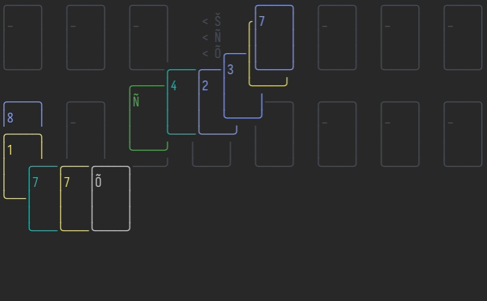

# Shenzhen Solitaire 🀙🀐🀇

<div align="center">

</div>

Shenzhen I/O Solitaire is a bit like FreeCell but played with a partial Mahjong
deck. It's an open information game with a high solve rate, given correct play.

[Buy the real game.](https://store.steampowered.com/app/570490/SHENZHEN_SOLITAIRE/)

## Game Rules

There are 40 cards,

- 3x9 "suited" cards, `Coin`, `String` and `Myriad`.
- 3x4 "dragon" cards, ~~`Trogdor Š`~~ `Red Š`, `Green Ñ` and `White Õ`.
- 1 "flower" card, `ƒ`.

Shenzhen Solitaire is similar to FreeCell, with a majhong deck instead. The
goal is to place all suited cards in the top right foundations and all dragon
cards in the top left cells.

The top row has 3 cells that may hold one card at a time, of any kind.

The next 4 slots are foundations which must build sequences from 1 to 9 in the
same suit, except the first slot may only hold the `ƒ` card.

The tableau operates under normal solitaire rules, you may only place cards in
descending, alternating suit sequences except when the column is empty. Empty
columns accept any card.

Note that by these rules, you can not build off or use dragons cards in a
sequence!

When 4 dragon cards of the same type (`Š`, `Ñ` or `Õ`) are accessible (either
in the tableau or cells), you may activate the appropriate button to shift all
cards of that type to an unoccupied cell. Once this is done that cell is locked.

## Commands and Controls

Open a new buffer and run `:ShenzhenSolitaireNewGame` to play, or call `:lua
require("shenzhen-solitaire")["start-new-game"](buf-id config seed-number)`.

The game will automatically move the `ƒ` to its foundation, as well as any
suited cards to a foundation if there are no other cards of lower value in
play. You may disable automatic moves via the configuration.

The default controls are:

- `Left Mouse`: pick up or put down cards.
- `Right Mouse`: return cards to original location. Note you must right click a
  UI element, not blank space.
- `y`: pickup or put down cards
- `szw`: save current game
- `szl`: load last save
- `szr`: restart current game
- `u`: undo last move (if enabled)
- `<Tab>`: move cursor to next location
- `<S-Tab>`: move cursor to next location

## Configuration

Any given config is merged onto the following via `vim.tbl_deep_extend`, use
that knowledge to infer how much of the config you must provide when changing
options.

If you're primarily playing with a mouse you may prefer to set `cursor.show =
false` and `difficulty.show-valid-locations = false`.

The buffer filetype is set to `shenzhen-solitaire` if you would like to run any
autocommands to clean up the UI.

```fennel
  {:card {:size {:width 7 :height 5}
          :borders {:ne :╮ :nw :╭ :se :╯ :sw :╰ :n :─ :s :─ :e :│ :w :│}}
   :buttons {:pos {:row 1 :col 34}}
   :tableau {:pos {:row 7 :col 1}
             :gap 3}
   :cell {:pos {:row 1
                :col 1}
          :gap 3}
   :foundation {:pos {:row 1 :col 41}
                :gap 3}
   :highlight {:empty {:fg :grey :bg hl-normal-background}
               :button {:fg :gray :bg hl-normal-background}
               :coin {:fg :#e8df78 :bg hl-normal-background}
               :string {:fg :#879ff6 :bg hl-normal-background}
               :myriad {:fg :#23b3ac :bg hl-normal-background}
               :flower {:fg :#934188 :bg hl-normal-background}
               :dragon-green {:fg :#52ad56 :bg hl-normal-background}
               :dragon-white {:fg :#cfcfcf :bg hl-normal-background}
               :dragon-red {:fg :#d34d4d :bg hl-normal-background}}
   :info {:pos {:row 22 :col 3}}
   :size {:width 80 :height 40}
   :cursor {:show true} ;; show cursor, strongly recommended without a mouse
   :difficulty {:show-valid-locations true ;; show possible interactive locations, useful without a mouse.
                :allow-undo false
                :auto-move-obvious true}
   :keys {:left-mouse :<LeftMouse>
          :right-mouse :<RightMouse>
          :interact :y
          :auto-move :a
          :save-game :szw
          :load-game :szl
          :restart-game :szr
          :undo-last-move :u
          :next-location :<Tab>
          :prev-location :<S-Tab>}}
```

## TODO

- Option to save after every move and auto-load the last game.
  - Or possibly hook `BufPreWrite` and allow saving on `:w`.
- Animation

## License

This game is treeware. If you like it, plant a tree near you. [(Also buy the
real game.)](https://store.steampowered.com/app/570490/SHENZHEN_SOLITAIRE/)
